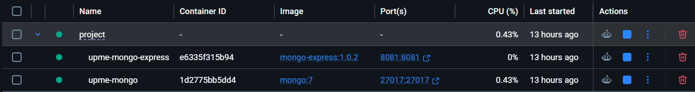
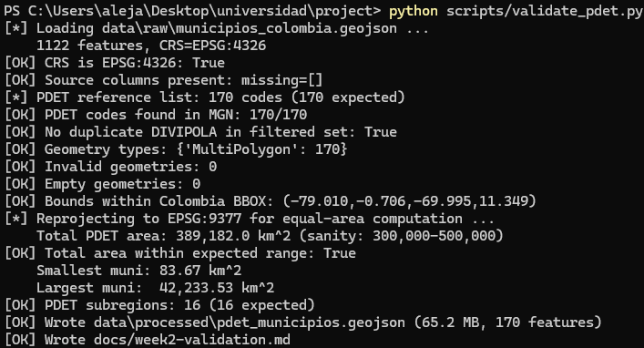
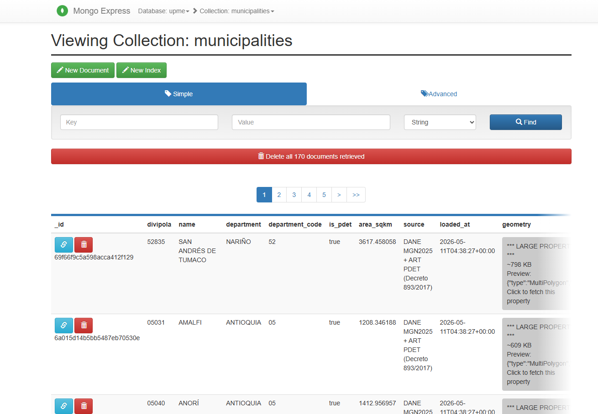
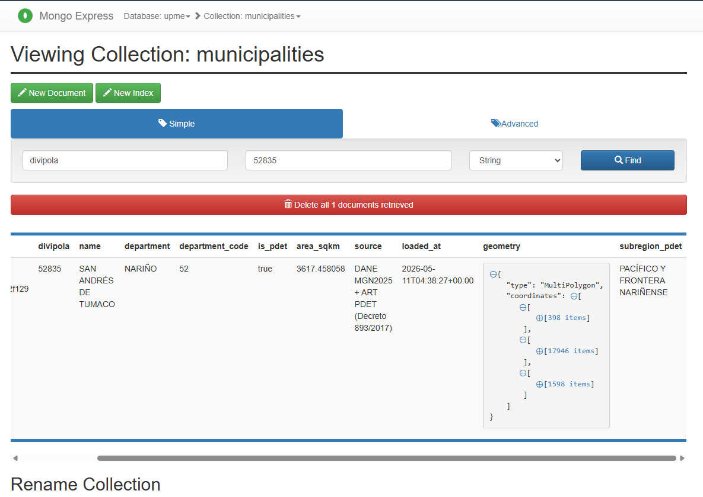
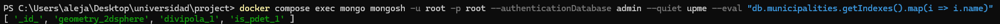
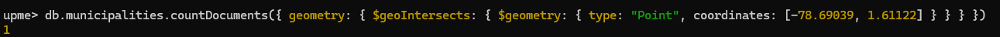
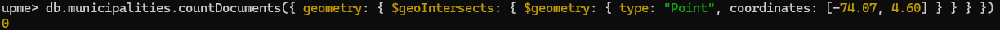

# Week 2 — PDET Municipality Boundaries Dataset Integration

**Course:** Database Administration
**Deliverable:** Week 2 — PDET Municipality Boundaries
**Date:** 2026-05-11
**Repository:** `project/`

---

## 1. Scope

This deliverable integrates the official set of 170 PDET municipalities
(*Programas de Desarrollo con Enfoque Territorial*, Decreto 893 de 2017)
into a MongoDB collection with spatial indexing, ready for the building
footprint join in Week 3.

The deliverable is evaluated against four checkpoints:

1. Data Acquisition & Verification
2. Data Integrity & Format
3. NoSQL Spatial Integration
4. Documentation of Process

Each section below documents the evidence for one checkpoint.

---

## 2. Infrastructure

The project runs in Docker. MongoDB 7 and Mongo Express are orchestrated
through `docker-compose.yml`. Bringing the stack up takes a single
command.



The `upme-mongo` service exposes MongoDB on port 27017 and
`upme-mongo-express` exposes the browser UI on port 8081. Both containers
are healthy; the database is reachable.

---

## 3. Checkpoint 1 — Data Acquisition & Verification

Two authoritative sources were combined:

| Dataset | Provider | Role |
| --- | --- | --- |
| MGN 2025 (Marco Geoestadístico Nacional) | DANE | Polygon geometry for all 1,122 Colombian municipalities, EPSG:4326 |
| MunicipiosPDET.xlsx | ART (Agencia de Renovación del Territorio) | Legal list of 170 PDET municipalities per Decreto 893/2017 |

Both sources are documented in `data/raw/SOURCES.md` (URLs, download
dates, licenses, and a reproduction recipe).

The ART list was cross-joined against the MGN GeoJSON by DIVIPOLA code.
**Result: 170 / 170 codes matched. Zero orphans.** This eliminates any
risk of unmatched names or stale municipal codes.

---

## 4. Checkpoint 2 — Data Integrity & Format

`scripts/validate_pdet.py` runs eleven automated checks and writes the
result to `docs/week2-validation.md` on every execution. The audit log
re-generates each run, so it is always synchronized with the data on
disk.



Checks performed:

1. **CRS** — input is EPSG:4326.
2. **Required source columns** present (`mpio_cdpmp`, `mpio_cnmbr`,
   `dpto_cnmbr`, `dpto_ccdgo`, `mpio_ccdgo`).
3. **170 / 170 PDET DIVIPOLA codes** present in the MGN dataset.
4. **No duplicate DIVIPOLA** in the filtered subset.
5. **Geometry types** restricted to Polygon / MultiPolygon (result: 170
   MultiPolygons).
6. **Geometry validity** (`shapely.is_valid`) — 0 invalid geometries.
   `make_valid` is applied defensively if any are found.
7. **No empty geometries.**
8. **Bounds inside Colombia's bounding box.**
9. **Total area in sanity range** — computed 389,182 km² (≈ 34 % of
   national territory, consistent with ART's published figures).
10. **16 PDET subregiones** present after merge (matches Decreto
    893/2017).
11. **Cleaned output file written** — `data/processed/pdet_municipios.geojson`.

### Coordinate-reference decisions

Stored geometry remains in **EPSG:4326** because MongoDB's `2dsphere`
index requires it. Area cannot be measured in degrees, so polygons are
reprojected to **EPSG:9377 (MAGNA-SIRGAS Origen Nacional)** — Colombia's
official equal-area CRS — and the resulting `area_sqkm` is stored as a
plain number on each document. Queries therefore never need to reproject.

---

## 5. Checkpoint 3 — NoSQL Spatial Integration

`scripts/load_municipalities.py` upserts the 170 cleaned polygons into
the `upme.municipalities` collection, keyed on DIVIPOLA. The load is
idempotent: re-running replaces documents in place.

### Collection state

The Mongo Express UI confirms 170 documents in the collection:



### Document shape

Each document follows the `$jsonSchema` validator installed by
`scripts/init.js`. Below is a single document expanded in Mongo Express,
showing the canonical field set (`divipola`, `name`, `department`,
`is_pdet`, `area_sqkm`, `subregion_pdet`, `source`, `loaded_at`,
`geometry`).



### Indexes and spatial query proof

Three indexes are provisioned at initialization time:

- `geometry_2dsphere` — spherical spatial index for `$geoWithin` /
  `$geoIntersects`.
- `divipola_1` *(unique)* — upsert key and lookup index.
- `is_pdet_1` — selective filter for downstream queries.

The screenshots below show the indexes and two `$geoIntersects` queries
that together prove both the index and the PDET scoping are correct.

**Indexes listed in mongosh:**



**`$geoIntersects` from a point inside Tumaco** (DIVIPOLA 52835 — a
PDET municipality):



Result: **1** — the query correctly returns San Andrés de Tumaco.

**`$geoIntersects` from a point inside Bogotá D.C.** (NOT a PDET
municipality):



Result: **0** — the collection correctly excludes Bogotá, proving the
PDET-only scoping is honored end-to-end.

The Bogotá miss is as load-bearing as the Tumaco hit. If the loader had
inadvertently inserted all 1,122 MGN municipalities, the same query
would return Bogotá D.C. The zero result confirms scope correctness.

---

## 6. Checkpoint 4 — Documentation of Process

Three documents describe how this deliverable was built and how to
re-run it:

- `data/raw/SOURCES.md` — provenance, licenses, download dates,
  reproduction steps for both raw sources.
- `docs/week2-validation.md` — auto-generated audit log of the 11
  integrity checks. Regenerates on every `validate_pdet.py` run.
- `docs/week2-pdet-loading.md` — full methodology write-up, including
  the rationale for CRS choices, the spatial-join-at-load pattern, and
  caveats.

The pipeline reproduces from a clean checkout in five commands:

```bash
docker compose up -d
docker compose exec mongo mongosh -u root -p root \
    --authenticationDatabase admin /scripts/init.js
# (place data/raw/municipios_colombia.geojson per SOURCES.md)
python scripts/validate_pdet.py
python scripts/load_municipalities.py
```

`load_municipalities.py` finishes with the same spatial sanity queries
shown in Section 5, so a successful run always demonstrates the
2dsphere index is live.

---

## 7. Summary

| Checkpoint | Evidence | Status |
| --- | --- | --- |
| Data Acquisition & Verification | Two sources, 170/170 join, `SOURCES.md` | Complete |
| Data Integrity & Format | 11 / 11 automated checks pass; `week2-validation.md` | Complete |
| NoSQL Spatial Integration | 170 docs, 4 indexes, `$geoIntersects` proves Tumaco hit + Bogotá miss | Complete |
| Documentation of Process | `SOURCES.md`, `week2-validation.md`, `week2-pdet-loading.md`, 5-command reproduce path | Complete |

The PDET municipality collection is loaded, indexed, and verified. It
exposes the contract that Week 3's building loader will consume: every
building's containing PDET municipality can be resolved with a single
indexed `$geoIntersects` lookup against `upme.municipalities`.

---

## Appendix A — Top 10 PDET municipalities by area

| DIVIPOLA | Name | Department | Area (km²) |
| --- | --- | --- | ---: |
| 18756 | SOLANO | CAQUETÁ | 42,233.5 |
| 18753 | SAN VICENTE DEL CAGUÁN | CAQUETÁ | 20,170.1 |
| 95001 | SAN JOSÉ DEL GUAVIARE | GUAVIARE | 16,712.4 |
| 95015 | CALAMAR | GUAVIARE | 13,510.3 |
| 95200 | MIRAFLORES | GUAVIARE | 12,774.7 |
| 18150 | CARTAGENA DEL CHAIRÁ | CAQUETÁ | 12,771.4 |
| 95025 | EL RETORNO | GUAVIARE | 12,405.9 |
| 50325 | MAPIRIPÁN | META | 11,917.5 |
| 86573 | PUERTO LEGUÍZAMO | PUTUMAYO | 10,900.4 |
| 50350 | LA MACARENA | META | 8,108.5 |

## Appendix B — PDET subregion breakdown

| Subregión PDET | Munis | Área (km²) |
| --- | ---: | ---: |
| MACARENA - GUAVIARE | 12 | 96,169 |
| CUENCA DEL CAGUÁN Y PIEDEMONTE CAQUETEÑO | 17 | 93,298 |
| CHOCÓ | 14 | 29,548 |
| PUTUMAYO | 9 | 25,063 |
| SIERRA NEVADA - PERIJÁ | 15 | 20,415 |
| BAJO CAUCA Y NORDESTE ANTIOQUEÑO | 13 | 17,615 |
| PACÍFICO Y FRONTERA NARIÑENSE | 11 | 17,119 |
| PACÍFICO MEDIO | 4 | 14,302 |
| ALTO PATÍA Y NORTE DEL CAUCA | 24 | 13,178 |
| ARAUCA | 4 | 10,540 |
| SUR DE BOLÍVAR | 7 | 10,332 |
| SUR DE CÓRDOBA | 5 | 9,581 |
| URABÁ ANTIOQUEÑO | 8 | 9,459 |
| CATATUMBO | 8 | 9,238 |
| SUR DEL TOLIMA | 4 | 6,919 |
| MONTES DE MARÍA | 15 | 6,407 |
| **TOTAL** | **170** | **389,182** |
