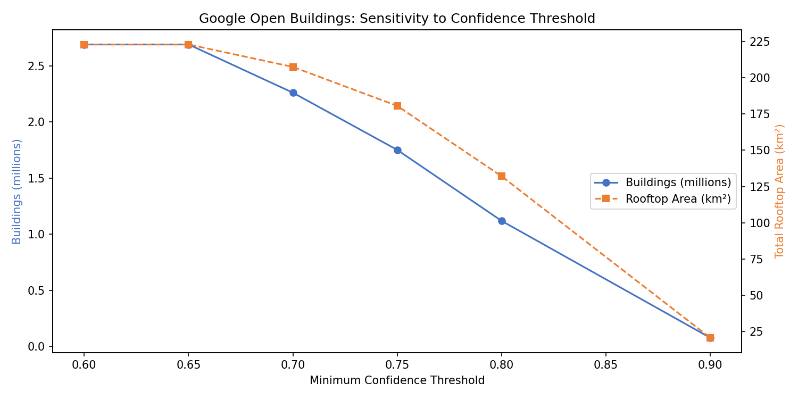
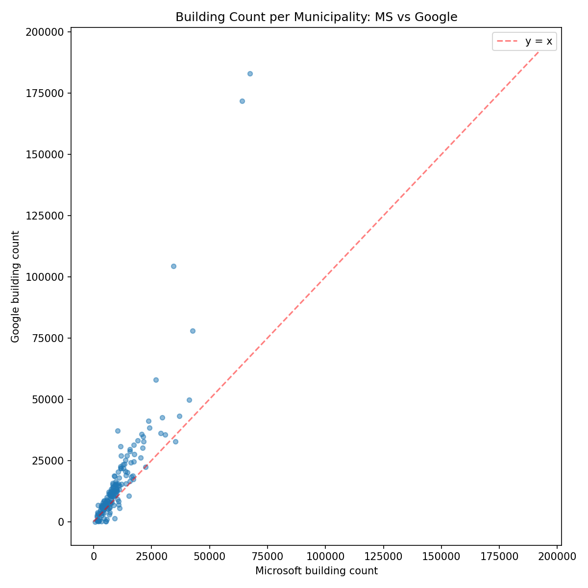
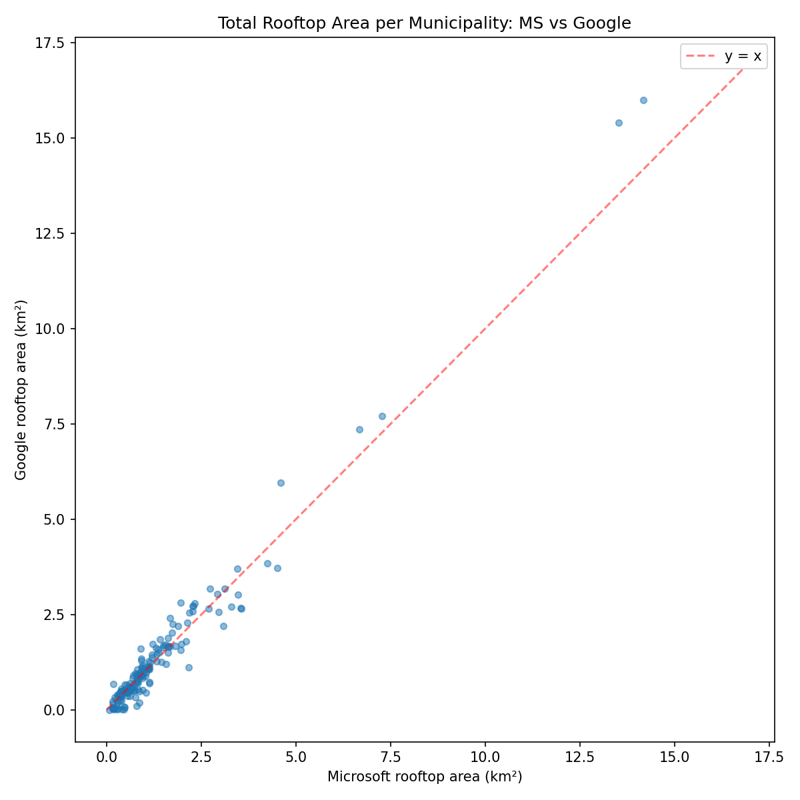
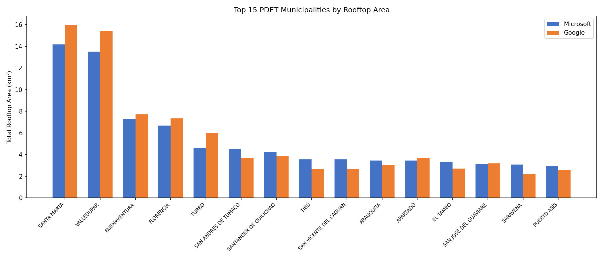

# Week 4 — Reproducible Geospatial Analysis Workflow

Generated: 2026-05-24T02:58:48+00:00

---

## 1. Methodology

### 1.1 Data Sources

Building footprints loaded in Week 3 from two open datasets:

| Source | Collection | Documents | License |
| --- | --- | ---: | --- |
| Microsoft Global Building Footprints | `buildings_ms` | 1,763,356 | ODbL |
| Google Open Buildings v3 | `buildings_google` | 2,691,812 | CC BY-4.0 / ODbL |

Municipality boundaries (169 PDET polygons) in `upme.municipalities`.

### 1.2 Aggregation Pipeline

Each building collection is aggregated independently with the following
MongoDB aggregation pipeline:

```
$match  → {divipola: {$ne: null}}
$group  → by divipola: $sum(count), $sum(area_sqm), $avg(area_sqm), $percentile(area_sqm, 0.5)
$lookup → municipalities (for name, department)
$unwind → flatten lookup array
$project→ shape to results.schema.json
```

Each result document is upserted into `upme.results` with unique key
`(divipola, source)`, producing one row per municipality per dataset.

### 1.3 Area Computation

Building areas (`area_sqm`) were pre-computed at load time (Week 3) using
EPSG:9377 (MAGNA-SIRGAS Origen Nacional), Colombia's official equal-area
projected CRS. This avoids latitude-dependent distortion inherent in WGS84
geographic coordinates. Geometries are stored in EPSG:4326 for MongoDB's
`2dsphere` index compatibility.

### 1.4 Median via MongoDB 7 `$percentile`

MongoDB 7.0 introduced `$percentile` as a group accumulator. The pipeline
uses `method: "approximate"` (t-digest algorithm) to compute median area
without sorting the full dataset in memory. This is bounded-memory and
accurate within ~1% of the true median.

### 1.5 Sensitivity to Google Confidence Threshold

Google Open Buildings assigns a confidence score in [0.6, 1.0] to each
detection. The pipeline was re-run at thresholds [0.6, 0.65, 0.7, 0.75,
0.8, 0.9] to measure how building counts and total area change. Microsoft
does not provide a confidence score (all detections included).

---

## 2. Aggregation Results

### 2.1 National Totals

| Metric | Microsoft | Google | Ratio (G/MS) |
| --- | ---: | ---: | ---: |
| Buildings | 1,763,356 | 2,691,812 | 1.53x |
| Total rooftop area (km²) | 221.18 | 222.90 | 1.01x |
| Mean building area (m²) | 114.55 | 80.61 | 0.70x |
| Municipalities with data | 169 | 165 | — |

Google detects significantly more buildings than Microsoft, but at smaller
mean footprint sizes. Total rooftop area converges between sources,
indicating both capture similar aggregate coverage despite different
detection sensitivities.

### 2.2 Per-Municipality Results (Top 20)

| DIVIPOLA | Name | Department | MS count | MS area km² | MS mean m² | MS median m² | Google count | Google area km² | Google mean m² | Google median m² |
| --- | --- | --- | ---: | ---: | ---: | ---: | ---: | ---: | ---: | ---: |
| 47001 | SANTA MARTA | MAGDALENA | 67,435 | 14.18 | 210.21 | 100.49 | 183,114 | 16.00 | 87.39 | 58.45 |
| 20001 | VALLEDUPAR | CESAR | 64,088 | 13.53 | 211.07 | 92.68 | 171,908 | 15.41 | 89.65 | 55.96 |
| 76109 | BUENAVENTURA | VALLE DEL CAUCA | 34,382 | 7.27 | 211.34 | 93.29 | 104,324 | 7.70 | 73.82 | 52.18 |
| 18001 | FLORENCIA | CAQUETÁ | 26,757 | 6.67 | 249.40 | 106.64 | 57,994 | 7.35 | 126.81 | 84.03 |
| 05837 | TURBO | ANTIOQUIA | 42,642 | 4.59 | 107.66 | 72.35 | 77,890 | 5.96 | 76.56 | 58.40 |
| 52835 | SAN ANDRES DE TUMACO | NARIÑO | 41,294 | 4.51 | 109.21 | 76.94 | 49,702 | 3.71 | 74.65 | 60.13 |
| 19698 | SANTANDER DE QUILICHAO | CAUCA | 30,873 | 4.24 | 137.50 | 92.39 | 35,527 | 3.85 | 108.35 | 75.39 |
| 54810 | TIBÚ | NORTE DE SANTANDER | 35,339 | 3.55 | 100.55 | 68.61 | 32,767 | 2.65 | 80.80 | 59.65 |
| 18753 | SAN VICENTE DEL CAGUÁN | CAQUETÁ | 22,363 | 3.54 | 158.45 | 95.70 | 22,232 | 2.67 | 119.91 | 74.96 |
| 81065 | ARAUQUITA | ARAUCA | 29,059 | 3.46 | 119.13 | 80.58 | 36,164 | 3.02 | 83.54 | 59.06 |
| 05045 | APARTADÓ | ANTIOQUIA | 10,304 | 3.45 | 334.41 | 96.00 | 37,193 | 3.70 | 99.45 | 66.51 |
| 19256 | EL TAMBO | CAUCA | 37,012 | 3.29 | 89.02 | 68.65 | 43,200 | 2.71 | 62.70 | 45.88 |
| 95001 | SAN JOSÉ DEL GUAVIARE | GUAVIARE | 21,535 | 3.11 | 144.36 | 86.13 | 32,798 | 3.17 | 96.72 | 65.67 |
| 81736 | SARAVENA | ARAUCA | 17,499 | 3.08 | 176.04 | 86.93 | 27,625 | 2.19 | 79.32 | 58.56 |
| 86568 | PUERTO ASÍS | PUTUMAYO | 20,266 | 2.96 | 146.17 | 86.29 | 26,218 | 2.56 | 97.81 | 73.43 |
| 23807 | TIERRALTA | CÓRDOBA | 29,628 | 2.93 | 98.73 | 74.61 | 42,469 | 3.04 | 71.60 | 55.50 |
| 81794 | TAME | ARAUCA | 20,687 | 2.73 | 131.92 | 82.21 | 35,728 | 3.18 | 89.10 | 61.71 |
| 23466 | MONTELÍBANO | CÓRDOBA | 21,096 | 2.70 | 128.00 | 79.66 | 30,083 | 2.66 | 88.34 | 64.71 |
| 19142 | CALOTO | CAUCA | 16,173 | 2.33 | 143.95 | 88.18 | 24,041 | 2.79 | 116.13 | 71.23 |
| 19548 | PIENDAMÓ | CAUCA | 17,339 | 2.29 | 131.93 | 88.39 | 31,395 | 2.71 | 86.47 | 55.13 |

Full results: [`data/processed/results_summary.csv`](../data/processed/results_summary.csv) (334 rows).

### 2.3 Cross-Source Divergence

- Municipalities with MS data: **169**
- Municipalities with Google data: **165**
- Municipalities with both: **165**
- Municipalities where counts differ > 20%: **126** (76%)

The high divergence rate confirms the project mandate to compare both
datasets rather than relying on a single source.

---

## 3. Sensitivity Analysis

Impact of increasing the minimum confidence threshold on Google results:

| Min confidence | Munis with data | Buildings | Total area (km²) |
| ---: | ---: | ---: | ---: |
| 0.60 | 165 | 2,691,812 | 222.90 |
| 0.65 | 165 | 2,691,812 | 222.90 |
| 0.70 | 165 | 2,261,910 | 207.42 |
| 0.75 | 164 | 1,751,854 | 180.57 |
| 0.80 | 164 | 1,119,363 | 132.10 |
| 0.90 | 163 | 77,003 | 20.76 |



Raising the threshold from 0.6 to 0.7 reduces building count while
preserving most of the total rooftop area, suggesting that low-confidence
detections tend to be small structures. A threshold of 0.7 offers a
reasonable accuracy-coverage tradeoff.

---

## 4. Visualizations

### 4.1 Choropleth Maps

Interactive Folium maps with hover tooltips:

| Map | File |
| --- | --- |
| MS building count | [`map_microsoft_building_count.html`](map_microsoft_building_count.html) |
| MS rooftop area | [`map_microsoft_rooftop_area.html`](map_microsoft_rooftop_area.html) |
| Google building count | [`map_google_building_count.html`](map_google_building_count.html) |
| Google rooftop area | [`map_google_rooftop_area.html`](map_google_rooftop_area.html) |

### 4.2 Cross-Source Comparisons



Points above the red y=x line indicate municipalities where Google
detects more buildings than Microsoft (majority of cases).



Rooftop area shows tighter agreement between sources than raw building
counts, as Google's extra detections tend to be small structures.

### 4.3 Top 15 Municipalities



---

## 5. Reproducibility

```bash
# Prerequisites: MongoDB running, venv activated, Week 3 data loaded
source .venv/bin/activate

# Run the full analysis workflow
MONGO_URI="mongodb://localhost:27017/" python scripts/analyze.py

# Output files:
#   upme.results              — 334 documents (169 MS + 165 Google)
#   data/processed/results_summary.csv
#   data/processed/sensitivity_google.csv
#   docs/week4-report.md
#   docs/map_*.html           — 4 choropleth maps
#   docs/chart_*.png          — 4 comparison charts
```

---

## 6. Known Limitations

- **San José de Uré (23580)**: missing from municipality polygons (GADM 4.1
  limitation, documented in Week 3). Buildings in this territory are absent.
- **Approximate median**: `$percentile` uses t-digest; exact median would
  require sorting the full collection per group.
- **Google confidence floor**: all detections have confidence >= 0.6. The
  sensitivity analysis cannot assess detections below this threshold.
- **Area source difference**: Microsoft areas are computed via EPSG:9377
  reprojection; Google areas come from the source CSV `area_in_meters`
  field (satellite-derived). Minor methodological differences are expected.
